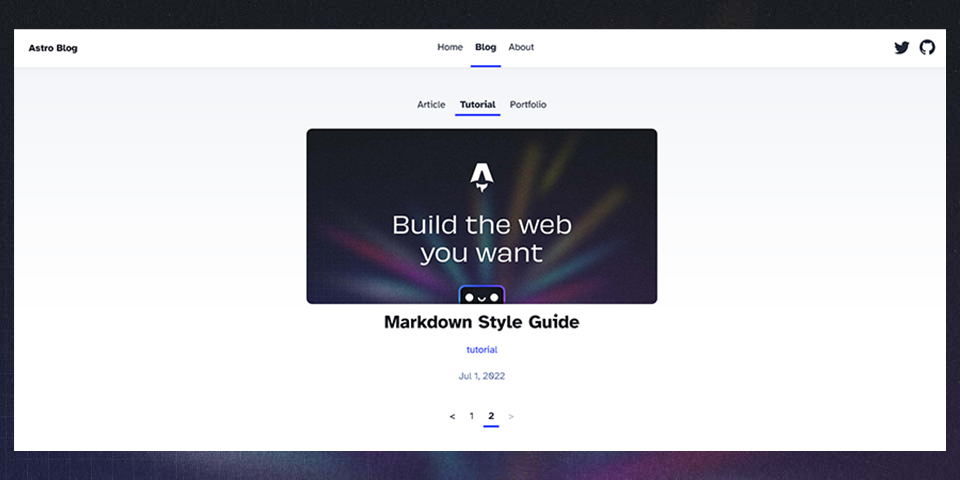

# Filtered & Paginated Astro Blog

  

This template was implemented in this [guide](https://rainrain.io/blog/dynamic-routes).

This is the [Astro Starter Kit: Blog](https://github.com/withastro/astro/tree/main/examples/blog) template,
with some additional features:

- [Pagination](src/pages/blog/[...filter]/[...page].astro) with a [control component](src/components/Pagination.astro).
- Filtering by tag with a [tag cloud component](src/components/Filtering.astro).

## Resources

- [Get Started](https://docs.astro.build/getting-started/) building a site with Astro
- [Dynamic Routing](https://docs.astro.build/guides/routing/) in Astro.

## Credit

[Astro Starter Kit: Blog](https://github.com/withastro/astro/tree/main/examples/blog) based on [Bear Blog](https://github.com/HermanMartinus/bearblog/).
